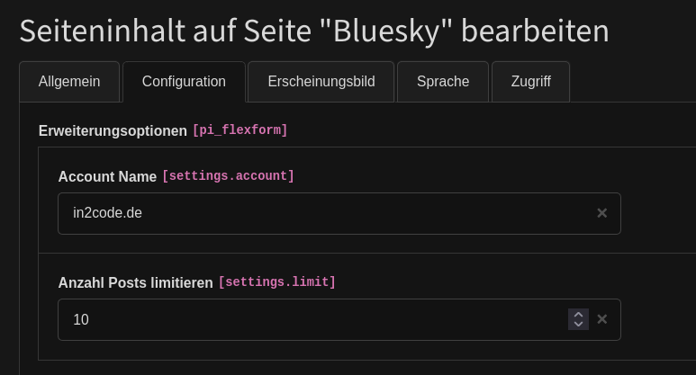

# Bluesky extension

## Introduction

Simple content element to show a bluesky feed by account name for TYPO3 13 or newer.

## Screenshots

Example output of posts in frontend:


Example plugin settings in backend:



## Howto

Do you want to change the html template of the list view? Sure, you want to change it.
You can do it simply via TypoScript setup:

```
plugin.tx_bluesky {
  view {
    templateRootPaths {
      1 = EXT:sitepackage/Resources/Private/ExtensionView/Plugins/Bluesky/Templates/
    }
  }
}
```

## Development

You can spin up a development environment for this extension using [DDEV](https://ddev.com/).

```shell
ddev start
ddev initialize
ddev restart # sometimes needed to copy configuration presets properly
```

The default backend user present in the database dump has the credentials `admin` / `John3:16`.

## Changelog

| Version | Date       | State   | Description                                                                             |
|---------|------------|---------|-----------------------------------------------------------------------------------------|
| 1.4.0   | 2025-07-26 | Task    | Move icon registration to configuration folder and remove ext_tables.php file           |
| 1.3.0   | 2025-03-08 | Feature | Also support full profile url for account id, improve placeholder text in plugin        |
| 1.2.0   | 2025-03-06 | Feature | Add local development environment                                                       |
| 1.1.0   | 2025-03-05 | Feature | Autolink url in posts, don't use ascii characters as hashtags, ignore colon in hashtags |
| 1.0.1   | 2025-03-05 | Bugfix  | Use default values if FlexForm is empty                                                 |
| 1.0.0   | 2025-03-05 | Task    | Initial publish of the extension                                                        |
